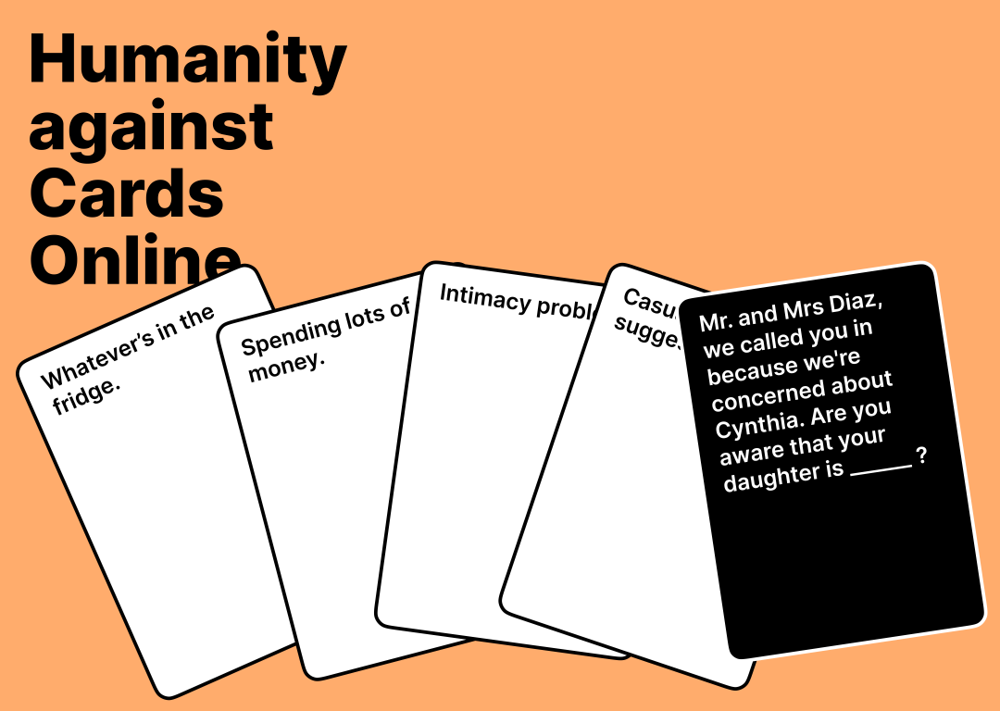
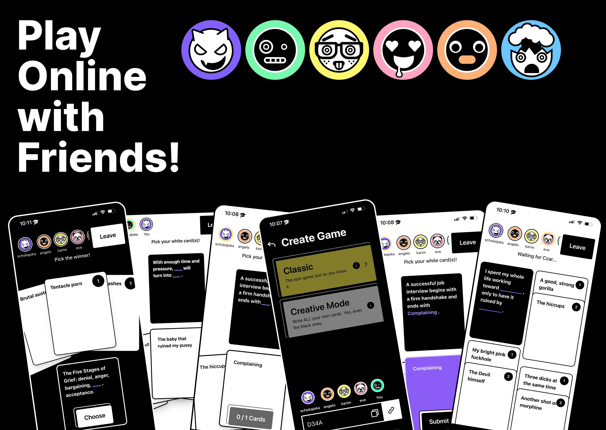
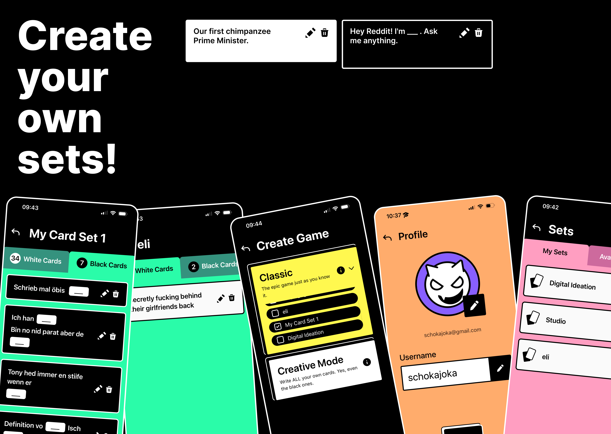
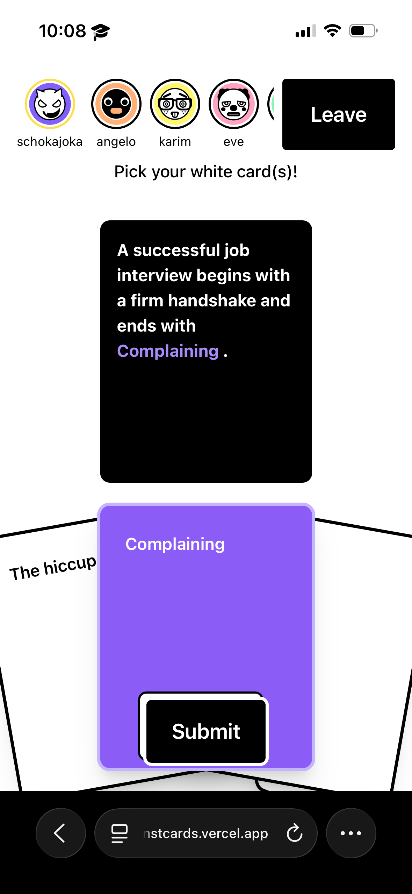
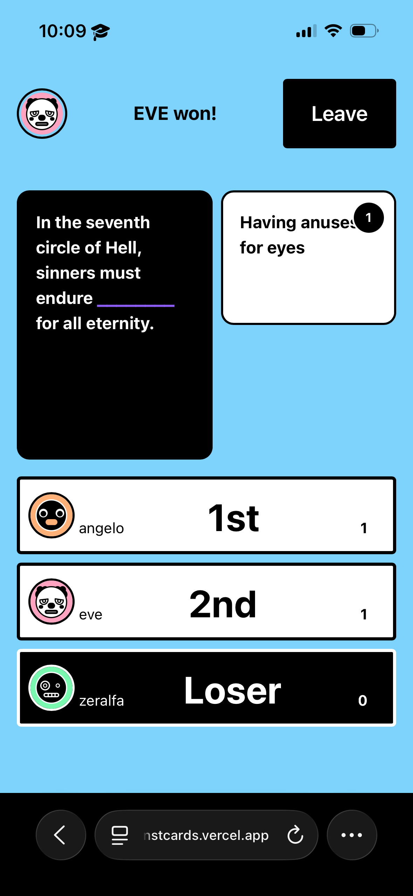

# Humanity Against Cards

**Humanity Against Cards** is a real-time, multiplayer web-based card game inspired by the popular "Cards Against Humanity." Built with **Nuxt 4** and **Supabase**, it offers a seamless and interactive experience for players to compete, create, and share their own humor.

## Screenshots

### Title Cover (Landscape, 1080x768)



Format: Landscape. Copyright (c) 2026 Joel Kammermann, Eve Steiger, Karim Pathan.

### Play Online with Friends (Landscape)



Format: Landscape. Copyright (c) 2026 Joel Kammermann, Eve Steiger, Karim Pathan.

### Create Your Own Sets (Landscape)



Format: Landscape. Copyright (c) 2026 Joel Kammermann, Eve Steiger, Karim Pathan.

### Gameplay (Portrait)



Format: Portrait. Copyright (c) 2026 Joel Kammermann, Eve Steiger, Karim Pathan.

### Lobby (Portrait)



Format: Portrait. Copyright (c) 2026 Joel Kammermann, Eve Steiger, Karim Pathan.

## Production URL

- **URL:** https://humanityagainstcards.vercel.app/

## Overview

- **Title:** Humanity Against Cards
- **Group members:** Joel Kammermann, Eve Steiger, Karim Pathan
- **Roles:** Joel Kammermann(development), Eve Steiger (development); Karim Pathan (UX design)
- **Module / Semester / Year:** Studio UX & Web 2 / 4th semester / 2026
- **Intellectual property declaration:** All content (code, design, text, screenshots) was created by the group members. Third-party content remains property of its respective owners.

## 🚀 Features

- **Real-time Multiplayer:** Instant synchronization between players using Supabase Realtime.
- **Multiple Game Modes:**
  - **Classic:** Play with predefined card sets (Official or User-created).
  - **Creative:** Write your own white cards every round! The Czar also gets to craft the black card.
- **Custom Card Sets:** Create, manage, and share your own collections of black and white cards.
- **Save Your Creations:** In Creative mode, the Game Master can save all the hilarious cards written during a session into a permanent collection.
- **User Authentication:** Support for permanent accounts and guest logins.
- **Mobile-First Design:** A sleek, responsive UI built with Tailwind CSS, optimized for mobile devices.

## 🛠️ Tech Stack

- **Frontend:** [Nuxt 4](https://nuxt.com/) (Vue 3, TypeScript)
- **Styling:** [Tailwind CSS](https://tailwindcss.com/)
- **Backend & Database:** [Supabase](https://supabase.com/)
  - **Authentication:** For user management and guest accounts.
  - **PostgreSQL:** To store rooms, players, cards, and collections.
  - **Realtime:** To sync game state and player actions instantly.
  - **Edge Functions:** To handle server-side game logic securely.

## 🎮 How to Play

1.  **Create or Join a Room:** One player creates a room and shares the 4-character room code.
2.  **Select a Mode:** The Game Master chooses between **Classic** or **Creative** mode.
3.  **Start the Game:** At least 2 players are required to begin.
4.  **The Round:**
    - A **Czar** is chosen for each round.
    - A **Black Card** (question/prompt) is drawn or created.
    - Players submit their **White Cards** (answers) to fill the gaps.
    - The Czar reviews all submissions and picks their favorite.
5.  **Scoring:** The winner of the round receives a point, and the next round begins!

## 💻 Getting Started

### Prerequisites

- Node.js (v18 or higher)
- npm, pnpm, or yarn
- A Supabase account and project

### Installation

1.  **Clone the repository:**

    ```bash
    git clone https://github.com/your-username/HumanityAgainstCards.git
    cd HumanityAgainstCards
    ```

2.  **Install dependencies:**

    ```bash
    npm install
    ```

3.  **Environment Variables:**
    Create a `.env` file in the root directory and add your Supabase credentials:

    ```env
    SUPABASE_URL=https://your-project-id.supabase.co
    SUPABASE_KEY=your-anon-key
    ```

4.  **Run the development server:**

    ```bash
    npm run dev
    ```

5.  **Open the app:**
    Navigate to `http://localhost:3000` in your browser.

## 📦 Production

To build the application for production:

```bash
npm run build
```

To preview the production build locally:

```bash
npm run preview
```

## 📄 License

This project is licensed under the MIT License.
